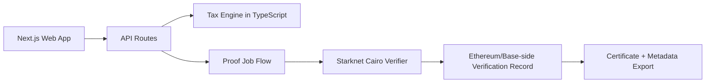

<div align="center">

# ProofOS

### Privacy-preserving crypto income and tax proofs for India

ProofOS turns wallet activity into verifiable financial claims without exposing your full transaction history.

[](https://proofos-theta.vercel.app)
[](https://youtu.be/XYTxudlp9fI)
[](https://sepolia.basescan.org)
[](LICENSE)

[Open Demo](https://proofos-theta.vercel.app) | [Watch Video](https://youtu.be/XYTxudlp9fI) | [Quick Start](#quick-start) | [Contracts](#deployed-contracts)

</div>

---

## Why this exists

Traditional reporting tools usually force a bad trade-off:

- Share full wallet dumps and lose privacy.
- Share summaries and lose credibility.

ProofOS removes that trade-off by combining deterministic Indian tax logic with on-chain verifiability.

| Need | What ProofOS does |
| --- | --- |
| Loan eligibility proof | Prove threshold-based income claims without exposing raw ledger details |
| Visa or audit evidence | Produce tamper-evident tax and income certificates |
| Partner or investor trust | Offer cryptographic verification instead of spreadsheets |

---

## What you can prove

- "My crypto income this year is above INR X"
- "My tax liability was computed as INR Y under encoded rules"
- "My net worth crossed INR Z"

All claims are generated from the same ledger commitment used for proof flow, then anchored for independent verification.

---

## Product flow

```text
1) Connect wallet(s) on Base Sepolia
2) Ingest and normalize transfers
3) Compute tax using deterministic AY 2026-27 logic
4) Generate proof payload path on Starknet
5) Verify and anchor outcome to EVM verifier
6) Export certificate with verification metadata
```

---

## Core capabilities

- Privacy-first claim sharing (no raw wallet export required)
- India-focused tax engine with deterministic rule paths (Section 115BBH, Section 44ADA, rebate, surcharge, cess, marginal relief, and individual/HUF/corporate-compatible tracks)
- Multi-wallet workflows with ENS club integration
- Certificate generation with ledger commitment and verification references
- Optional decentralized publishing integrations (for configured environments)

---

## Architecture at a glance



### Stack

- Web: Next.js 16, React 18, Tailwind CSS 4
- Wallet and chain: RainbowKit, Wagmi, Starknet React
- Contracts: Solidity + Foundry, Cairo + Scarb
- Infra: Vercel, Alchemy, Starknet Sepolia, Base Sepolia

---

## Deployed contracts

### Base Sepolia (chain id 84532)

These addresses are present in Foundry broadcast artifacts and return bytecode on Base Sepolia RPC.

- DemoToken: [0x121354bcaf7134f9477b61a0b45909db8a6b2807](https://sepolia.basescan.org/address/0x121354bcaf7134f9477b61a0b45909db8a6b2807)
- ProfitMachine: [0xabce611586bdb9eb18b79086d79dbea123dab6e0](https://sepolia.basescan.org/address/0xabce611586bdb9eb18b79086d79dbea123dab6e0)
- LossMachine: [0x1afb1765ea821c394d2459c4f40b267e3d86528b](https://sepolia.basescan.org/address/0x1afb1765ea821c394d2459c4f40b267e3d86528b)
- YieldFarm: [0x269127888e4adcaef8fb69ffd4bf5973b4c62de5](https://sepolia.basescan.org/address/0x269127888e4adcaef8fb69ffd4bf5973b4c62de5)
- TaxVerifier: [0x04c998dd105e444570ba1ecacb3f5524d5695aa0](https://sepolia.basescan.org/address/0x04c998dd105e444570ba1ecacb3f5524d5695aa0)

Source artifact: [contracts/broadcast/DeployBase.s.sol/84532/run-latest.json](contracts/broadcast/DeployBase.s.sol/84532/run-latest.json)

### Starknet and Ethereum Sepolia

- Starknet verifier and Ethereum verifier wiring are present in repo flow.
- Keep frontend env values aligned with the addresses you actively deploy.

---

## Quick start

### Prerequisites

- Node.js 18+
- Foundry
- Scarb

### 1. Web app setup

```bash
cd apps/web
npm install
cp .env.local.example .env.local
```

PowerShell alternative:

```powershell
Copy-Item .env.local.example .env.local
```

Fill required variables in .env.local:

```env
NEXT_PUBLIC_WALLETCONNECT_PROJECT_ID=...
ALCHEMY_API_KEY=...
NEXT_PUBLIC_CAIRO_CONTRACT_ADDRESS=0x...
NEXT_PUBLIC_TAX_VERIFIER_ADDRESS=0x...
```

Run local app:

```bash
npm run dev
```

### 2. Contract environment setup

```bash
cd contracts
cp ../.env.example ../.env
```

PowerShell alternative:

```powershell
Copy-Item ..\.env.example ..\.env
```

Then set values in .env as needed for deployment scripts.

---

## Deploy guide

### Web (Vercel)

1. Import repository in Vercel.
2. Set root directory to apps/web.
3. Use npm install and npm run build.
4. Add required environment variables.

### EVM contracts (Foundry)

```bash
cd contracts
forge script script/DeployTaxVerifier.s.sol:DeployTaxVerifierScript \
     --rpc-url $SEPOLIA_RPC_URL \
     --broadcast
```

### Cairo contracts (Scarb and Starkli)

```bash
cd contracts/starknet
scarb build
starkli declare target/dev/tax_verifier_TaxVerifier.contract_class.json
starkli deploy <class_hash>
```

---

## Repository map

```text
ProofOS/
|- apps/
|  |- web/                  # Next.js UI + API routes
|- contracts/
|  |- src/                  # Solidity contracts
|  |- script/               # Foundry scripts
|  |- starknet/src/         # Cairo contracts
|- LICENSE
|- README.md
```

---

## Real-world scenarios

1. Home loan screening using privacy-preserving income proofs.
2. Visa and compliance packets with verifiable tax metadata.
3. Audit defense with deterministic recomputation trail.
4. Consolidated multi-wallet reporting for treasury or family office workflows.

---

## Security note

This is a hackathon-stage project and not legal or tax advice.
Use with professional review before production or filing workflows.

Report sensitive issues privately instead of opening a public issue.

---

## License

MIT. See [LICENSE](LICENSE).

---

<div align="center">

ProofOS

Because financial proof should be verifiable and private.

</div>